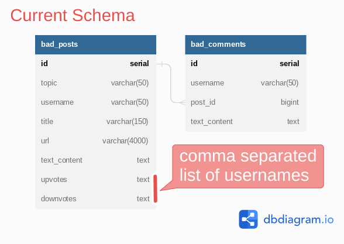
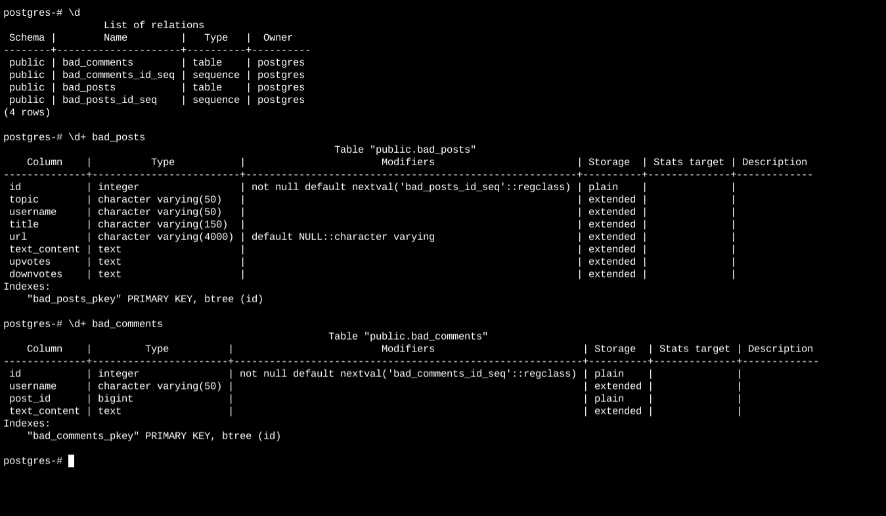
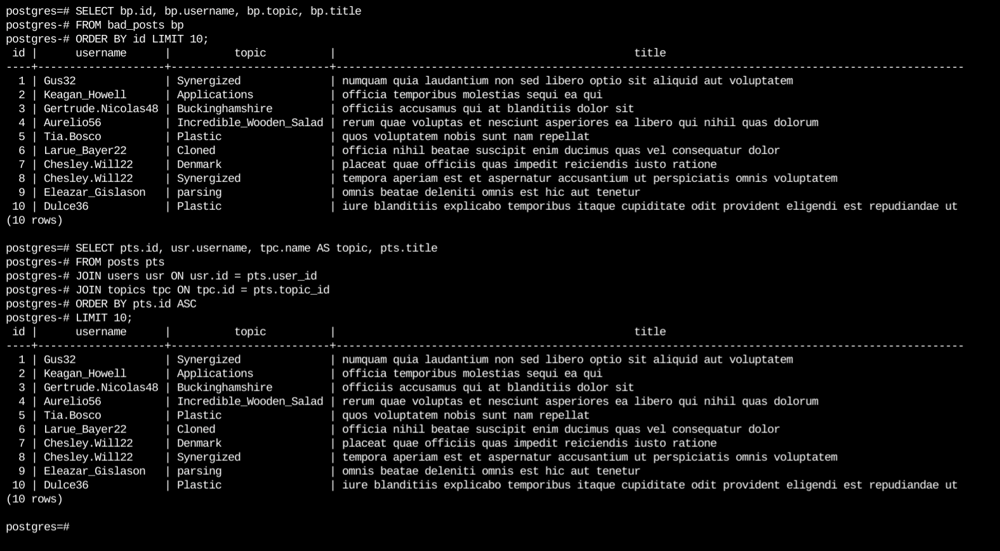
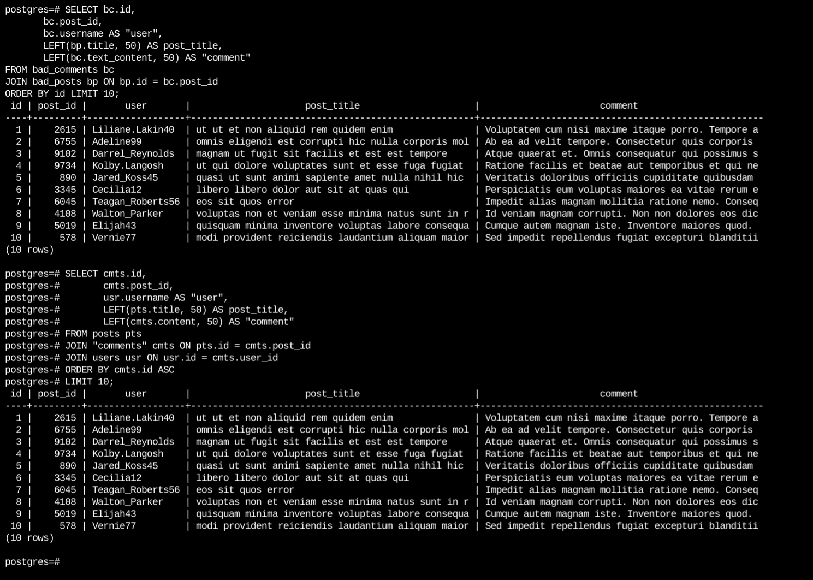

# Exodus
Investigate, fix and migrate a social news aggregator's relational database :writing_hand:




#### DB Console View (click to enlarge)


> **PS :** `bad_post` has 50K records while `bad_comments` has 100K records. 

1.  `bad_posts` is poorly structured to contain data that should ideally be in other tables and only then referenced from the `bad_posts` table. The way the username, upvotes and downvotes column is used is proof of this fact.
2.  `bad_posts` has very little data constraints and validation where it should.  Since the url column is optional, the title and text_content need to be not null, at least conditionally.
3.  The upvotes and downvotes columns in `bad_posts` being text will make filtering or aggregating on them very difficult .
4.  `bad_comments` seems to allow empty comments since the text_content column is not constrained with no null.
5.  Intuitively, comments are usually threaded, but `bad_comments` does not seem to indicate any support for that,
6.  Placing the actual text username of the author into `bad_posts` or `bad_comments` means the data can easily become inconsistent. At least it will be a nightmare to maintain data consistency and data integrity in the face of change. Ideally, username should only be updatable in a single place.


### Proposed New Schema


> Summarized below :point_down: Full details are [:point_right: in here](./src/proposed/) 

#### Guideline 1: Features and specifications that Udacious needs to support its website and admin interface :sunglasses: :nerd_face:

1.  Allow new users to register
2.  Allow registered users to create new topics
3.  Allow registered users to create new posts on existing topics
4.  Allow registered users to comment on existing posts
5.  Make sure that a given user can only vote once on a given post


#### Guideline 2: Queries that Udacious needs to support its website and admin interface :sunglasses: :nerd_face:

1.  List all users who haven’t logged in in the last year.
2.  List all users who haven’t created any post.
3.  Find a user by their username.
4.  List all topics that don’t have any posts.
5.  Find a topic by its name.
6.  List the latest 20 posts for a given topic.
7.  List the latest 20 posts made by a given user.
8.  Find all posts that link to a specific URL, for moderation purposes. 
9.  List all the top-level comments (those that don’t have a parent comment) for a given post.
10.  List all the direct children of a parent comment.
11.  List the latest 20 comments made by a given user.
12.  Compute the score of a post, defined as the difference between the number of upvotes and the number of downvotes


### Migrate Existing Data To New Schema [`DEV / LOCAL`] :thumbsup:

The DML for migrating data is in [src/migrate/dml.sql](./src/migrate/dml.sql), but below are the snippets for migrating `users` :

```sql
-- users
DROP TABLE IF EXISTS "users";
CREATE TABLE "users" (
  "id" SERIAL PRIMARY KEY,
  "username" VARCHAR(25) UNIQUE NOT NULL,
  "last_seen" TIMESTAMP WITH TIME ZONE,
  "created_at" TIMESTAMP WITH TIME ZONE NOT NULL default CURRENT_TIMESTAMP
);

ALTER TABLE "users" 
	ADD CONSTRAINT "non_empty_username" CHECK (LENGTH(TRIM("username")) > 0);

WITH allusers AS (
    SELECT username FROM bad_posts
    UNION SELECT unnest(string_to_array(upvotes, ',')) AS username FROM bad_posts
    UNION SELECT unnest(string_to_array(downvotes, ',')) AS username FROM bad_posts
    UNION SELECT username FROM bad_comments
)
INSERT INTO "users" ("username") SELECT DISTINCT username FROM allusers;

```

> There are lots of duplicate users in different places e.g `SELECT COUNT(users) FROM (SELECT username AS users FROM bad_posts) t1` shows 50K users **vs**
`SELECT COUNT(users) FROM (SELECT DISTINCT username AS users FROM bad_posts) t1` shows 100 distinct users who've created posts.
Also, querying for upvotes with `SELECT unnest(string_to_array(upvotes, ',')) AS users` **vs** `SELECT DISTINCT unnest(string_to_array(upvotes, ',')) AS users` results in 249.7k vs 1.1k users while a smilimar query for downvotes results in 249.9k vs 1.1k users. Comsequently, total users (across `username`, `upvotes`, and `downvotes` in the `bad_posts` table and `username` in the `bad_comments` table) sits at ~11.0k

#### Data After Migrating Posts (click to enlarge)

<br>

#### Data After Migrating Comments (click to enlarge)



### TODO: Migrate Existing Data To New Schema [`PROD / LIVE`] :crossed_fingers: :muscle:
